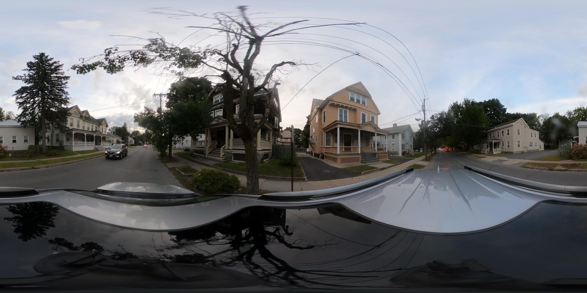
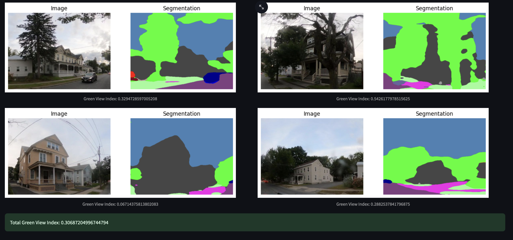

# Green View Index Segmentation Method

This module applies a segmentation method to extract the Green View Index (GVI) from a given image by splitting the image into 4 parts and then calculating the vegetation pixels. It leverages the code found in the [StreetView-NatureVisibility](https://github.com/Spatial-Data-Science-and-GEO-AI-Lab/StreetView-NatureVisibility)




## Prerequisites

Have [Python 3.9+](https://www.python.org/downloads/)

```bash
pip install -r requirements.txt
```

## How to Run

### Web app

To start the streamlit app run:
```bash
streamlit run example_viewer_st.py
```

This will open the app in localhost:8501

### CLI

To run in the cli do:
```bash
python do_segmentation.py
```

You can embed the pipeline by calling the `segmentation_pipeline` function in other code.